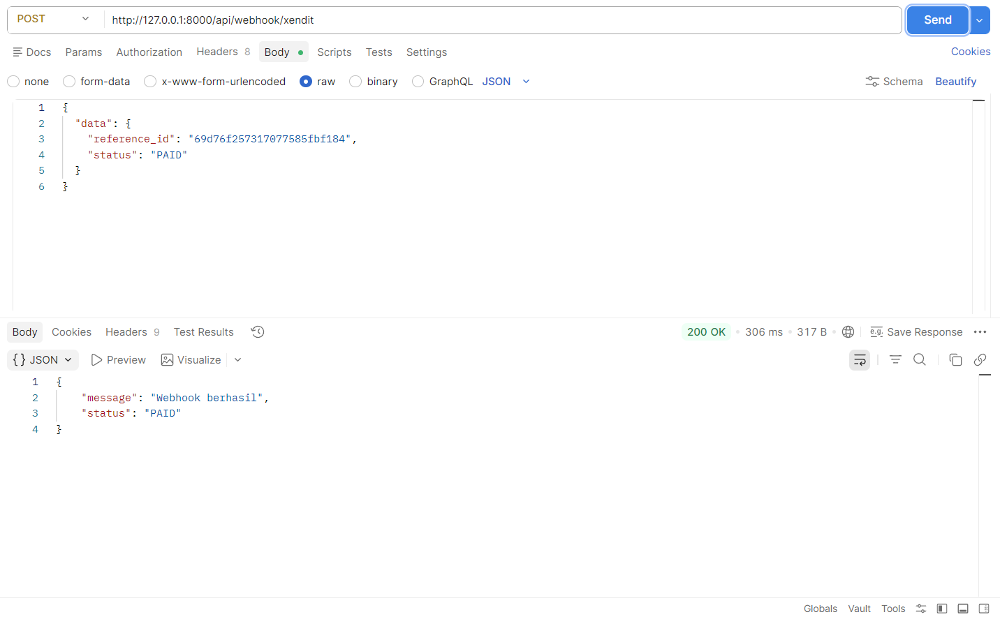
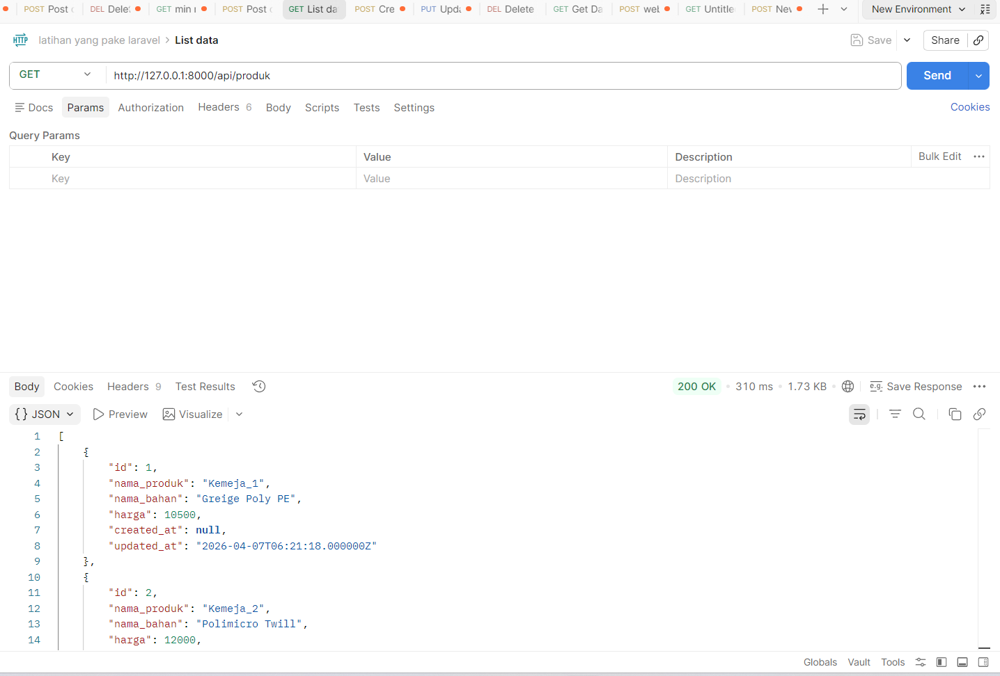
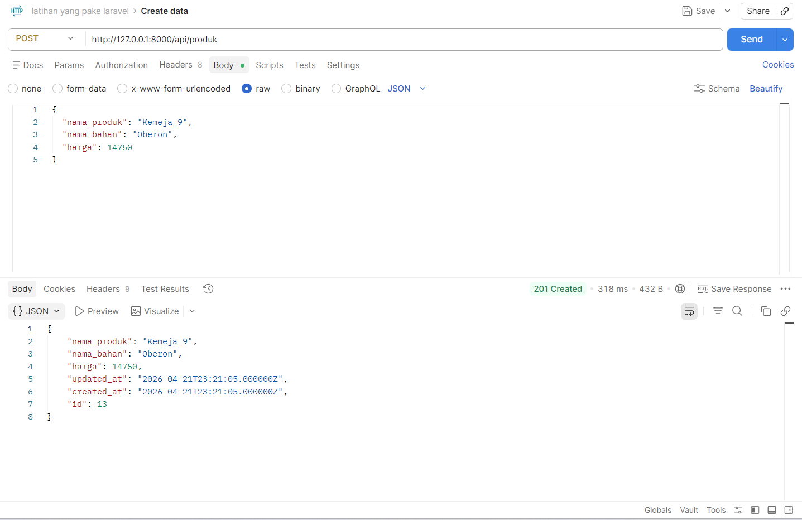

# laravel-payment-integration-xendit
REST API built with Laravel for handling payment transactions integrated with Xendit payment gateway.
# Laravel Xendit Payment API

## 📌 Overview

This project is a backend RESTful API built using Laravel that integrates with the Xendit payment gateway to handle online payment transactions.

It demonstrates a complete end-to-end payment processing system, including invoice creation, payment handling, and webhook-based status updates.

---
**🔄 Payment Flow**

Client sends request to create payment invoice
Backend generates invoice via Xendit API
User completes payment through Xendit
Xendit sends webhook callback to backend
Backend updates transaction status in database

---
**🚀 Features**
Create payment invoices via Xendit API
Handle payment callbacks (webhooks)
Store and manage transaction data
RESTful API architecture
Request validation and error handling

---
**💡 Key Highlights**
Integration with third-party payment gateway (Xendit)
Implementation of webhook for real-time payment updates
End-to-end payment workflow
Clean and structured Laravel backend architecture

---
**🛠️ Tech Stack**
Backend: Laravel
Database: MySQL
API Integration: Xendit Payment Gateway
Tools: Postman, Composer

---
**📂 Project Structure**
app/Http/Controllers/Api → API Controllers
app/Models → Database Models
routes/api.php → API Routes
database/migrations → Database schema

---
**⚙️ Installation & Setup**
1. Clone repository
git clone https://github.com/USERNAME/laravel-xendit-payment-api.git
2.  Install dependencies
composer install
3. Copy environment file
cp .env.example .env
4. Generate application key
php artisan key:generate
5. Configure database in .env
6. Run migration
php artisan migrate
7. Run server
php artisan serve

---
**🔐 Environment Variables**

Make sure to configure:

DB_DATABASE
DB_USERNAME
DB_PASSWORD
XENDIT_API_KEY

---
## 🔄 API Endpoints

### 🔹 Create Invoice
POST /api/create-invoice  
Generate payment invoice using Xendit API.

### 🔹 Webhook Callback
POST /api/webhook/xendit  
Handle payment status updates from Xendit.

### 🔹 Get Produk
GET /api/produk  
Retrieve product data from database.

### 🔹 Create Produk
POST /api/produk  
Create new product data.

---
## 📸 API Preview

### 🔹 Webhook Handling (Xendit)
Handles payment status updates from Xendit.


---

### 🔹 Get Produk (List Data)
Retrieve all product data from database.


---

### 🔹 Create Produk
Create new product data.

**Example Request**
```json
{
  "nama_produk": "Kemeja_9",
  "nama_bahan": "Oberon",
  "harga": 14750
}
---


## 👩‍💻 Author

Silvy Putri
